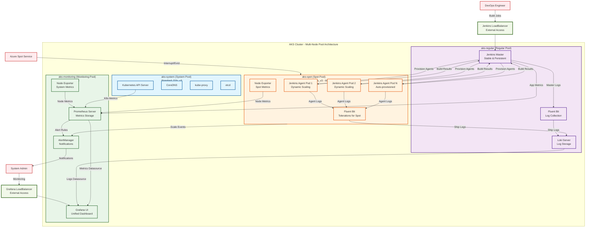
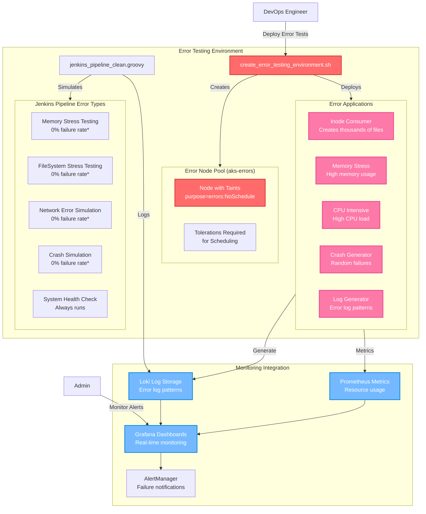
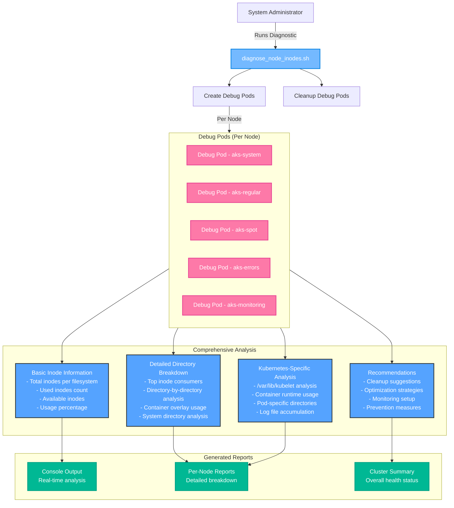

# AKS Jenkins Spot Workers + Complete Observability

This project sets up an AKS cluster with Jenkins Master and Workers on spot nodes, including complete unified observability (logs + metrics).

## Deployment Status: PRODUCTION READY

### Infrastructure Summary

**AKS Cluster Configuration:**
- **System Node Pool**: aks-system (1 node) - Kubernetes system components
- **Regular Node Pool**: aks-regular (1 node) - Jenkins Master + stable workloads
- **Spot Node Pool**: aks-spot (1 node) - Jenkins spot workers + cost-effective workloads
- **Monitoring Node Pool**: aks-monitoring (1 node) - Dedicated observability stack

**Total Infrastructure**: 4 nodes optimized for different workload types

## Project Structure

```
aks_troubleshooting_v2/
├── 00_setup_subscription.sh          # Azure initial setup
├── 01_create_cluster.sh               # AKS cluster creation
├── 02_deploy_jenkins.sh               # Jenkins Master deployment
├── 03_configure_jenkins_spot.sh       # Spot workers configuration
├── 04_aks_diagnostic_report_full.sh   # Cluster diagnostics
├── 05_install_observability.sh        # Observability stack (Logs)
├── 06_verify_spot_monitoring.sh       # Monitoring verification
├── 07_install_prometheus_monitoring.sh # Prometheus stack (Metrics)
├── 08_configure_unified_grafana.sh     # Unified Grafana dashboards
├── common.sh                          # Common functions
├── .env.production                    # Environment variables
├── grafana/                           # Grafana dashboard scripts
│   ├── create_jenkins_alerts.sh       # Jenkins alerting rules
│   ├── create_working_dashboard.sh     # Working dashboard
│   └── queries/                       # Pre-defined Loki queries
├── QUERIES.md                         # Complete Loki queries documentation
├── helm/                              # Helm configurations
│   ├── jenkins_helm_values.yaml       # Jenkins Master
│   ├── loki_helm_values.yaml          # Loki (logs)
│   ├── fluent_bit_helm_values.yaml    # Fluent Bit (collection)
│   ├── grafana_helm_values.yaml       # Grafana (visualization)
│   └── prometheus_helm_values.yaml    # Prometheus stack (metrics)
├── jenkins_scripts/                   # Groovy scripts
│   ├── jenkins_spot_cloud.groovy      # Cloud configuration
│   ├── demo_spot_complete_pipeline.groovy      # Demo pipeline
│   └── monitor_spot_workers_pipeline.groovy    # Monitoring pipeline
├── testing-errors/                    # Error testing environment
│   ├── create_error_testing_environment.sh    # Creates error node pool + apps
│   └── jenkins_pipeline_clean.groovy          # Error simulation pipeline
└── testing-inodes/                    # Inode diagnostics
    └── diagnose_node_inodes.sh         # Detailed inode analysis script
```

## Sequential Execution

### 1. Initial setup
```bash
./00_setup_subscription.sh
```

### 2. Cluster creation
```bash
./01_create_cluster.sh
```

### 3. Jenkins Master deployment
```bash
./02_deploy_jenkins.sh
```

### 4. Spot workers configuration
```bash
./03_configure_jenkins_spot.sh
```

### 5. Observability stack (Logs)
```bash
./05_install_observability.sh
```

### 6. Prometheus monitoring (Metrics)
```bash
./07_install_prometheus_monitoring.sh
```

### 7. Grafana dashboards

```bash
./grafana/create_working_dashboard.sh
```

### 8. Loki Queries Documentation

**Complete Query Collection:** [QUERIES.md](QUERIES.md)

The QUERIES.md file contains all Loki queries for:
- Basic Jenkins Master and Spot Workers monitoring
- Advanced configuration analysis
- Performance metrics and troubleshooting
- Error analysis and debugging

**Quick access examples:**
- All Jenkins Workers: `{kubernetes_namespace_name="jenkins-workers"}`
- Spot Workers only: `{kubernetes_namespace_name="jenkins-workers"} |= "spot"`
- Master Configuration: `{kubernetes_namespace_name="jenkins-master"} |~ "JAVA_OPTS|plugin|config"`

## Observability Stack Components

### Logs Stack (Loki)
- **Loki**: Log storage (regular nodes)
- **Fluent Bit**: Log collection (all nodes)
- **Grafana**: Visualization and dashboards (regular nodes)

### Metrics Stack (Prometheus)
- **Prometheus**: Metrics storage and collection (regular nodes)
- **Node Exporter**: System metrics from all nodes (spot & regular)
- **kube-state-metrics**: Kubernetes object metrics (regular nodes)
- **AlertManager**: Alert management and notifications (regular nodes)
- **Grafana**: Pre-configured dashboards for cluster monitoring

## Node Configuration

- **System**: Cluster components
- **Regular**: Jenkins Master, Loki, Grafana, Prometheus, AlertManager
- **Spot**: Jenkins Workers (with tolerations), Node Exporter

## Configuration Files

### Helm Values
- `helm/jenkins_helm_values.yaml`: Jenkins configuration with LoadBalancer
- `helm/loki_helm_values.yaml`: Loki SingleBinary for regular nodes
- `helm/fluent_bit_helm_values.yaml`: Collection with tolerations for all nodes
- `helm/grafana_helm_values.yaml`: Grafana with pre-configured Loki datasource
- `helm/prometheus_helm_values.yaml`: Prometheus stack with spot vs regular node monitoring

### Jenkins Scripts

- `jenkins_scripts/jenkins_spot_cloud.groovy`: Automatic spot cloud configuration
- `jenkins_scripts/demo_spot_complete_pipeline.groovy`: Professional demo pipeline
- `jenkins_scripts/monitor_spot_workers_pipeline.groovy`: Advanced monitoring pipeline

### Grafana Scripts

- `grafana/spot_dashboard.sh`: Spot workers specific monitoring dashboard
- `grafana/create_kubernetes_cluster_dashboard.sh`: AKS cluster comprehensive monitoring dashboard

### Query Documentation

- `QUERIES.md`: Complete collection of Loki queries for Jenkins Master and Spot Workers analysis

## Complete Observability Solution

The system includes:

### Logs (Loki Stack)
- Centralized logs in Loki
- Fluent Bit log collection from all nodes
- Jenkins Master and Workers logs
- Spot workers specific dashboards
- Pre-defined queries for troubleshooting

### Metrics (Prometheus Stack)
- Complete Kubernetes cluster metrics
- Node-level monitoring (CPU, Memory, Disk, Network)
- Spot vs Regular nodes comparison
- Container resource utilization
- Jenkins workload distribution
- Pod and service monitoring
- Real-time performance analysis

## Access

### Jenkins Infrastructure

- **Jenkins Master**: Available via LoadBalancer service
  - Username: `admin`
  - Password: `admin123`
  - **Features**: Spot workers configuration, pipeline automation

### Unified Observability (Single Grafana Instance)

- **Grafana Dashboard**: Available via LoadBalancer service
  - Username: `admin`
  - Password: `admin123`
  - **Features**:
    - Loki datasource (logs): 36 pre-configured queries
    - Prometheus datasource (metrics): Complete cluster metrics
    - Unified dashboards with both logs and metrics

### Backend Services (Internal Access Only)

- **Prometheus Server**: Internal service only (accessed via Grafana)
- **AlertManager**: Internal service only (accessed via Grafana)
- **Loki Server**: Internal service only (accessed via Grafana)
  - **Features**: Optimized resource usage, single access point

---

## Jenkins Plugins Configuration

This section provides detailed instructions for configuring essential Jenkins plugins that have been pre-installed in the cluster.

### Role-Based Strategy Plugin Configuration

The Role-Based Strategy plugin is pre-installed but requires manual configuration to define custom roles and permissions.

#### Overview

The Role-Based Strategy plugin allows you to:

- Create custom roles with specific permissions
- Assign users to roles for granular access control
- Separate administrative tasks from operational tasks
- Implement least-privilege security principles

#### Step-by-Step Configuration

##### 1. Enable Role-Based Authorization

1. **Access Jenkins**: Navigate to `http://[JENKINS-LOADBALANCER-IP]:8080`
2. **Login** with credentials:
   - Username: `admin`
   - Password: `admin`
3. **Navigate to Security Settings**:
   - Click **"Manage Jenkins"**
   - Click **"Configure Global Security"**
4. **Enable Role-Based Strategy**:
   - In the **"Authorization"** section
   - Select **"Role-Based Strategy"**
   - Click **"Save"**

##### 2. Create Custom Roles

After enabling Role-Based Strategy, you'll see a new option in the Jenkins management menu:

1. **Access Role Management**:
   - Go to **"Manage Jenkins"**
   - Click **"Manage and Assign Roles"**
   - Click **"Manage Roles"**

2. **Define Global Roles**:

   **Administrator Role**:

   ```text
   Role Name: administrators
   Permissions: 
   - Overall/Administer (full access)
   ```

   **Developer Role**:

   ```text
   Role Name: developers
   Permissions:
   - Overall/Read
   - Job/Build
   - Job/Cancel
   - Job/Read
   - Job/Workspace
   - View/Read
   ```

   **Operator Role**:

   ```text
   Role Name: operators
   Permissions:
   - Overall/Read
   - Job/Build
   - Job/Cancel
   - Job/Read
   - Job/Create
   - Job/Configure
   - Job/Delete
   - View/Read
   - View/Configure
   - View/Create
   - View/Delete
   ```

   **Read-Only Role**:

   ```text
   Role Name: viewers
   Permissions:
   - Overall/Read
   - Job/Read
   - View/Read
   ```

3. **Click "Save"** to create the roles

##### 3. Create Project-Specific Roles (Optional)

For project-based access control:

1. **In the "Project roles" section**:

   ```text
   Role Name: project-team-alpha
   Pattern: alpha-.*
   Permissions:
   - Job/Build
   - Job/Cancel
   - Job/Configure
   - Job/Read
   - Job/Workspace
   ```

2. **Create additional project roles** as needed for different teams

##### 4. Assign Users to Roles

1. **Navigate to Role Assignment**:
   - Go to **"Manage Jenkins"**
   - Click **"Manage and Assign Roles"**
   - Click **"Assign Roles"**

2. **Add Users to Global Roles**:

   ```text
   Global roles:
   - administrators: admin
   - developers: developer1, developer2
   - operators: ops-team, ci-cd-user
   - viewers: stakeholder1, manager1
   ```

3. **Add Users to Project Roles** (if configured):

   ```text
   Project roles:
   - project-team-alpha: alpha-dev1, alpha-dev2
   ```

4. **Click "Save"** to apply the assignments

#### Example Role Configurations

##### Complete Development Team Setup

```yaml
# Global Roles Configuration
administrators:
  users: [admin, lead-admin]
  permissions: [Overall/Administer]

senior-developers:
  users: [senior-dev1, senior-dev2]
  permissions:
    - Overall/Read
    - Job/Build, Job/Cancel, Job/Configure, Job/Create, Job/Delete, Job/Read, Job/Workspace
    - View/Read, View/Configure, View/Create, View/Delete
    - Credentials/View

developers:
  users: [dev1, dev2, dev3]
  permissions:
    - Overall/Read
    - Job/Build, Job/Cancel, Job/Read, Job/Workspace
    - View/Read

qa-team:
  users: [qa1, qa2]
  permissions:
    - Overall/Read
    - Job/Build, Job/Cancel, Job/Read
    - View/Read

# Project Roles Configuration
frontend-team:
  pattern: "frontend-.*"
  users: [frontend-dev1, frontend-dev2]
  permissions: [Job/Build, Job/Cancel, Job/Configure, Job/Read]

backend-team:
  pattern: "backend-.*|api-.*"
  users: [backend-dev1, backend-dev2]
  permissions: [Job/Build, Job/Cancel, Job/Configure, Job/Read, Job/Create]
```

#### Security Best Practices

1. **Principle of Least Privilege**:
   - Grant minimum permissions required for each role
   - Regularly review and audit user permissions

2. **Role Naming Convention**:

   ```text
   Global roles: team-function (e.g., dev-team, ops-team)
   Project roles: project-team (e.g., alpha-dev, beta-ops)
   ```

3. **Regular Permission Audits**:
   - Review role assignments monthly
   - Remove unused accounts
   - Update permissions based on team changes

4. **Project Pattern Examples**:

   ```text
   Frontend projects: "frontend-.*|ui-.*"
   Backend projects: "backend-.*|api-.*|service-.*"
   Infrastructure: "infra-.*|deploy-.*"
   Testing: "test-.*|qa-.*"
   ```

#### Troubleshooting Role-Based Strategy

##### Common Issues:

1. **Plugin Not Visible**:
   - Verify plugin installation: Go to **"Manage Jenkins"** → **"Plugins"** → **"Installed"**
   - Look for **"Role-based Authorization Strategy"**
   - Restart Jenkins if necessary

2. **Users Cannot Access Jobs**:
   - Check role assignments in **"Assign Roles"**
   - Verify project patterns match job names
   - Ensure users have the necessary global permissions

3. **Permission Denied Errors**:
   - Review the specific permissions required for the action
   - Check both global and project role permissions
   - Verify user is assigned to appropriate roles

##### Verification Commands:

```bash
# Check if plugin is installed
kubectl exec jenkins-master-0 -n jenkins-master -c jenkins -- ls -la /var/jenkins_home/plugins/ | grep role

# Restart Jenkins if needed
kubectl delete pod jenkins-master-0 -n jenkins-master

# Check Jenkins logs for permission errors
kubectl logs jenkins-master-0 -n jenkins-master -c jenkins | grep -i "permission\|role\|access"
```

#### Integration with Spot Workers

When configuring roles for spot worker environments:

1. **Spot Worker Permissions**:

   ```text
   Role: spot-workers-operators
   Permissions:
   - Overall/Read
   - Job/Build, Job/Cancel
   - Computer/Build (for spot workers)
   - Computer/Connect, Computer/Disconnect
   ```

2. **Cost Optimization Roles**:

   ```text
   Role: cost-analysts
   Permissions:
   - Overall/Read
   - Job/Read
   - Computer/Build (read-only access to worker metrics)
   ```

This role-based configuration ensures secure access management while maintaining the cost benefits of spot worker infrastructure.

---

## Available Dashboards

### Pre-configured Dashboards
- **AKS Unified Monitoring** - Metrics and logs in single dashboard  
- **AKS Spot vs Regular Nodes Analysis** - Performance comparison  
- **Jenkins Workers Activity** - Spot workers monitoring  
- **Kubernetes Cluster Overview** - Resource utilization  
- **Pod Distribution Analysis** - Workload placement monitoring  

### Legacy Dashboards (Still Available)
- **Jenkins Master and Spot Workers Logs** - 15 custom panels  
- **Log Exploration** - Direct access via Grafana Explore  

---

## System Architecture

### Complete AKS Jenkins Spot Workers + Observability Architecture



### Architecture Benefits

| Component | Purpose | Node Pool | Cost Optimization |
|-----------|---------|-----------|-------------------|
| **Jenkins Master** | Build orchestration & UI | Regular (Stable) | High availability |
| **Jenkins Agents** | Build execution | Spot (Cost-effective) | 60-90% cost savings |
| **Grafana** | Unified monitoring UI | Monitoring (Dedicated) | Performance isolation |
| **Prometheus** | Metrics collection | Monitoring (Dedicated) | Scalable storage |
| **Loki** | Log aggregation | Regular (Persistent) | Reliable log storage |
| **Fluent Bit** | Log collection | All pools | Universal coverage |

### Data Flow Summary

1. **Build Execution**: Jenkins Master → Spot Workers → Build Results
2. **Log Collection**: All pods → Fluent Bit → Loki → Grafana  
3. **Metrics Collection**: All nodes → Prometheus → Grafana
4. **Alerting**: Prometheus → AlertManager → Notifications
5. **Spot Management**: Azure → Spot Interruptions → Auto-scaling

---

## Complete Observability Features

### **Unified Monitoring System**
1. **Single Grafana Instance**: Combines log analysis (Loki) and metrics monitoring (Prometheus)
2. **Dual Datasources**: Seamless switching between logs and metrics in same interface

### **Key Monitoring Capabilities**
- **Spot vs Regular Performance**: Direct comparison dashboards
- **Jenkins Workers Monitoring**: Real-time spot workers activity
- **Resource Utilization**: CPU, Memory, Network across all node types
- **Cost Analysis**: Spot instances vs regular instances efficiency
- **Auto-scaling Insights**: Pod distribution and resource demands

### **Advanced Analytics**
- **36 Loki Queries**: From basic to advanced troubleshooting scenarios
- **Custom Metrics**: AKS-specific monitoring for spot instance behavior
- **Alert Rules**: Proactive monitoring with AlertManager
- **Historical Analysis**: Persistent storage for trend analysis
- **Unified Dashboards**: Metrics and logs in single view

---

## Quick Verification Commands

```bash
# Verify all systems
kubectl get nodes                           # Check all 4 node pools
kubectl get pods -A | grep -E "(jenkins|grafana|prometheus|loki)"  # Check services
kubectl get services -A | grep LoadBalancer  # Check external access

# Access monitoring
curl -s http://LoadBalancer-IP/api/health     # Unified Grafana health
```

---

## What's Been Achieved

### **Complete Infrastructure**
- Multi-node pool AKS cluster with optimized workload placement
- Dedicated monitoring infrastructure (Standard_D4s_v3)
- Proper taints and tolerations for workload isolation

### **Jenkins + Spot Workers**
- Jenkins Master on regular nodes for stability
- Dynamic spot workers for cost-effective build execution
- Complete pipeline automation and configuration

### **Unified Observability Stack**
- **Single Grafana Instance**: Centralized dashboard for logs and metrics
- **Loki**: Log aggregation with 36 pre-configured queries
- **Prometheus**: Metrics collection with custom AKS dashboards
- **AlertManager**: Proactive monitoring and alerting
- **Unified Interface**: Switch between datasources in same UI

### **Cost Optimization**
- Spot instances for Jenkins workers (60-90% cost savings)
- Dedicated monitoring node pool for observability isolation
- Efficient resource allocation across node types

### **Documentation and Organization**
- Complete project restructure with logical directories
- Comprehensive README with English documentation
- All Loki queries consolidated in QUERIES.md
- Sequential execution scripts (01-07)

---

## **Success Summary**

Your AKS cluster now has:
- Complete Jenkins automation with spot workers
- Unified observability system (single Grafana for logs + metrics)
- Cost-optimized infrastructure with 4 specialized node pools
- Custom dashboards for AKS spot vs regular analysis
- 36 pre-configured monitoring queries
- Dedicated monitoring infrastructure for scalability

**Ready for production workloads with comprehensive monitoring and cost optimization.**

- **Pod Failures**: Container restart and failure alerts
- **Spot Interruptions**: Preemption notifications
- **Jenkins Health**: Master and worker health monitoring

## Integration Benefits

---

## Error Testing Environment

### Overview

The error testing environment is designed to simulate various types of failures and stress conditions in a controlled AKS environment. This allows testing of monitoring systems, alerting mechanisms, and troubleshooting procedures.

### Architecture Flow



*Note: Failure rates set to 0% for predictable testing. Can be adjusted by modifying RANDOM threshold values.*

### Testing Components

#### 1. Error Node Pool Creation (`testing-errors/create_error_testing_environment.sh`)

**Purpose**: Creates a dedicated node pool for error testing applications

**What it does**:
- Creates `aks-errors` node pool with taints (`purpose=errors:NoSchedule`)
- Deploys namespace `testing-errors`
- Installs 5 different error-generating applications
- Configures proper tolerations for error testing workloads

**Key Features**:
```bash
# Node Pool Configuration
- Node VM Size: Standard_DS2_v2
- Auto-scaling: 1-2 nodes
- Taints: purpose=errors:NoSchedule
- Labels: purpose=errors, type=testing
- Zones: 1, 2, 3 (high availability)
```

**Deployed Applications**:
1. **Inode Consumer**: Creates thousands of small files
2. **Memory Stress**: High memory consumption patterns
3. **CPU Intensive**: Sustained CPU load
4. **Crash Generator**: Random application failures
5. **Log Generator**: Produces error log patterns

**Usage**:
```bash
cd testing-errors/
./create_error_testing_environment.sh
```

#### 2. Jenkins Error Testing Pipeline (`testing-errors/jenkins_pipeline_clean.groovy`)

**Purpose**: Comprehensive Jenkins pipeline for simulating different types of system failures

**Pipeline Parameters**:
- **ERROR_TYPE**: 
  - `ALL` - Runs all error types sequentially
  - `MEMORY` - Memory stress testing only
  - `FILESYSTEM` - FileSystem stress testing only
  - `NETWORK` - Network error simulation only
  - `CRASH` - Crash simulation only

- **FORCE_FAILURE**: 
  - `false` (default) - Random failures based on probability
  - `true` - Guaranteed pipeline failure

- **DURATION_SECONDS**: 
  - `30` (default) - Duration/intensity of each test
  - Higher values = more intensive testing

**Pipeline Stages**:

1. **Initialization**
   - System information gathering
   - Environment validation
   - Resource baseline measurement

2. **Memory Stress Testing**
   - Creates large files (size = DURATION_SECONDS MB)
   - Parallel processing simulation
   - Memory cleanup verification
   - **Current failure rate: 0%** (RANDOM < 0)

3. **FileSystem Stress Testing**
   - Creates 1000 small files
   - Intensive I/O operations
   - Large file creation (3x 10MB files)
   - Directory operations testing
   - **Current failure rate: 0%** (RANDOM < 0)

4. **Network Error Simulation**
   - DNS resolution testing
   - Connection timeout simulation
   - Latency measurement
   - Service connectivity testing
   - **Current failure rate: 0%** (RANDOM < 0)

5. **Crash Simulation**
   - Segmentation fault simulation
   - Out of memory simulation
   - Assertion failure simulation
   - Fatal timeout simulation
   - **Current failure rate: 0%** (RANDOM < 0)

6. **System Health Check**
   - Resource utilization summary
   - Performance metrics collection
   - Error summary reporting

**Pipeline Configuration**:
```groovy
# Kubernetes Agent Configuration
- Runs on: purpose=errors nodes
- Tolerations: purpose=errors:NoSchedule
- Resources: 100Mi-500Mi memory, 100m-500m CPU
- Timeout: 15 minutes with 2 retries
```

**How to Use**:
1. Access Jenkins: Available via LoadBalancer service
2. Create new Pipeline Job: "error-testing-pipeline"
3. Copy content from `jenkins_pipeline_clean.groovy`
4. Configure parameters:
   ```
   ERROR_TYPE: ALL (for comprehensive testing)
   FORCE_FAILURE: false (for random behavior)
   DURATION_SECONDS: 30 (moderate intensity)
   ```
5. Run "Build with Parameters"

**Customizing Failure Rates**:
To adjust failure probabilities, modify these values in the pipeline:
```bash
# Current settings (0% failure)
if [ $((RANDOM % 100)) -lt 0 ]; then  # 0% chance

# For 30% failure rate
if [ $((RANDOM % 100)) -lt 30 ]; then  # 30% chance

# For 50% failure rate  
if [ $((RANDOM % 100)) -lt 50 ]; then  # 50% chance
```

---

## Inode Diagnostics

### Overview

The inode diagnostics tool provides deep analysis of inode usage across AKS nodes, essential for troubleshooting "no space left on device" errors that occur due to inode exhaustion.

### Inode Analysis Flow



### Diagnostic Tool (`testing-inodes/diagnose_node_inodes.sh`)

**Purpose**: Comprehensive inode usage analysis across all AKS nodes

**What it analyzes**:

1. **Basic Inode Information**:
   - Total inodes per filesystem
   - Used and available inodes
   - Usage percentage and warnings

2. **Detailed Directory Breakdown**:
   - Top inode-consuming directories
   - Recursive directory analysis
   - File count per directory level

3. **Kubernetes-Specific Analysis**:
   - `/var/lib/kubelet` usage patterns
   - Container overlay directories
   - Pod-specific storage consumption
   - Log file accumulation

4. **Critical System Directories**:
   - `/tmp` usage analysis
   - `/var/log` log file consumption
   - System cache directories
   - Container image storage

**Key Features**:
- **Privileged Access**: Uses privileged pods for direct node filesystem access
- **Multi-Node Analysis**: Analyzes all nodes in the cluster simultaneously
- **Automated Cleanup**: Removes debug pods after analysis
- **Detailed Reporting**: Provides actionable recommendations

**Usage**:
```bash
cd testing-inodes/
./diagnose_node_inodes.sh
```

**Sample Output Analysis**:
```bash
# Basic Inode Information
Filesystem: /dev/sda1
Total Inodes: 6,553,600
Used Inodes: 2,847,392 (43%)
Available: 3,706,208

# Top Inode Consumers
/var/lib/kubelet/pods: 1,245,678 files
/var/lib/docker/overlay2: 892,341 files  
/tmp: 234,567 files
/var/log: 156,789 files

# Kubernetes-Specific Analysis
Container Overlay Usage: 45% of total inodes
Active Pod Directories: 127 pods
Log File Count: 45,678 files
```

**When to Use**:
- "No space left on device" errors despite available disk space
- Pod scheduling failures due to storage issues
- Performance degradation related to filesystem operations
- Routine cluster health monitoring
- Before and after deploying inode-intensive applications

---

## Comprehensive Testing Workflow

### End-to-End Testing Sequence

1. **Environment Setup**:
   ```bash
   # Deploy error testing environment
   cd testing-errors/
   ./create_error_testing_environment.sh
   
   # Verify error applications are running
   kubectl get pods -n testing-errors
   ```

2. **Baseline Measurement**:
   ```bash
   # Analyze inode usage before testing
   cd testing-inodes/
   ./diagnose_node_inodes.sh
   ```

3. **Execute Error Testing**:
   ```bash
   # Run Jenkins error simulation pipeline
   # Access: Available via LoadBalancer service
   # Job: error-testing-pipeline
   # Parameters: ERROR_TYPE=ALL, DURATION_SECONDS=60
   ```

4. **Monitor Real-time**:
   ```bash
   # Monitor via Grafana dashboards
   # Access: Available via LoadBalancer service
   # View: Error Testing Dashboard
   ```

5. **Post-Test Analysis**:
   ```bash
   # Re-run inode analysis
   cd testing-inodes/
   ./diagnose_node_inodes.sh
   
   # Compare before/after results
   ```

### Integration with Monitoring

**Grafana Integration**:
- Error testing metrics appear in unified dashboards
- Real-time resource consumption monitoring
- Alert triggers during intensive testing

**Loki Log Integration**:
- All error pipeline logs stored in Loki
- Error patterns easily searchable
- Historical failure analysis available

**Prometheus Metrics Integration**:
- Resource usage metrics during testing
- Node-level performance impact analysis
- Correlation between errors and resource consumption

---

## **Success Summary**

Your AKS cluster now has:
- Complete Jenkins automation with spot workers
- Unified observability system (single Grafana for logs + metrics)
- **Comprehensive error testing environment with controlled failure simulation**
- **Advanced inode diagnostics for troubleshooting storage issues**
- Cost-optimized infrastructure with 5 specialized node pools (including errors)
- Custom dashboards for AKS analysis including error testing monitoring
- 36+ pre-configured monitoring queries
- **Professional-grade testing tools for monitoring system validation**

**Ready for production workloads with comprehensive monitoring, cost optimization, and robust testing capabilities.**

Combining Loki (logs) with Prometheus (metrics) provides:
- **Complete Observability**: Logs + Metrics in unified dashboards
- **Root Cause Analysis**: Correlate log events with metric spikes
- **Proactive Monitoring**: Metrics-based alerting with log investigation
- **Cost Optimization**: Data-driven spot vs regular node decisions
