# AKS Jenkins Spot Workers + Complete Observability

This project sets up an AKS cluster with Jenkins Master and Workers on spot nodes, including complete unified observability (logs + metrics).

## Deployment Status: PRODUCTION READY

### Infrastructure Summary

**AKS Cluster Configuration:**
- **System Node Pool**: aks-system (1 node) - Kubernetes system components
- **Regular Node Pool**: aks-regular (1 node) - Jenkins Master + stable workloads
- **Spot Node Pool**: aks-spot (1 node) - Jenkins spot workers + cost-effective workloads
- **Monitoring Node Pool**: aks-monitoring (1 node) - Dedicated observability stack

**Total Infrastructure**: 4 nodes optimized for different workload types

## Project Structure

```
aks_troubleshooting_v2/
├── 00_setup_subscription.sh          # Azure initial setup
├── 01_create_cluster.sh               # AKS cluster creation
├── 02_deploy_jenkins.sh               # Jenkins Master deployment
├── 03_configure_jenkins_spot.sh       # Spot workers configuration
├── 04_aks_diagnostic_report_full.sh   # Cluster diagnostics
├── 05_install_observability.sh        # Observability stack (Logs)
├── 06_verify_spot_monitoring.sh       # Monitoring verification
├── 07_install_prometheus_monitoring.sh # Prometheus stack (Metrics)
├── common.sh                          # Common functions
├── .env.production                    # Environment variables
├── grafana/                           # Grafana dashboard scripts
│   ├── spot_dashboard.sh              # Spot monitoring dashboard
│   └── create_kubernetes_cluster_dashboard.sh # K8s cluster dashboard
├── QUERIES.md                         # Complete Loki queries documentation
├── helm/                              # Helm configurations
│   ├── jenkins_helm_values.yaml       # Jenkins Master
│   ├── loki_helm_values.yaml          # Loki (logs)
│   ├── fluent_bit_helm_values.yaml    # Fluent Bit (collection)
│   ├── grafana_helm_values.yaml       # Grafana (visualization)
│   └── prometheus_helm_values.yaml    # Prometheus stack (metrics)
└── jenkins_scripts/                   # Groovy scripts
    ├── jenkins_spot_cloud.groovy      # Cloud configuration
    ├── demo_spot_complete_pipeline.groovy      # Demo pipeline
    └── monitor_spot_workers_pipeline.groovy    # Monitoring pipeline
```

## Sequential Execution

### 1. Initial setup
```bash
./00_setup_subscription.sh
```

### 2. Cluster creation
```bash
./01_create_cluster.sh
```

### 3. Jenkins Master deployment
```bash
./02_deploy_jenkins.sh
```

### 4. Spot workers configuration
```bash
./03_configure_jenkins_spot.sh
```

### 5. Observability stack (Logs)
```bash
./05_install_observability.sh
```

### 6. Prometheus monitoring (Metrics)
```bash
./07_install_prometheus_monitoring.sh
```

### 7. Grafana dashboards

```bash
./grafana/spot_dashboard.sh
```

### 8. Loki Queries Documentation

**Complete Query Collection:** [QUERIES.md](QUERIES.md)

The QUERIES.md file contains all Loki queries for:
- Basic Jenkins Master and Spot Workers monitoring
- Advanced configuration analysis
- Performance metrics and troubleshooting
- Error analysis and debugging

**Quick access examples:**
- All Jenkins Workers: `{kubernetes_namespace_name="jenkins-workers"}`
- Spot Workers only: `{kubernetes_namespace_name="jenkins-workers"} |= "spot"`
- Master Configuration: `{kubernetes_namespace_name="jenkins-master"} |~ "JAVA_OPTS|plugin|config"`

## Observability Stack Components

### Logs Stack (Loki)
- **Loki**: Log storage (regular nodes)
- **Fluent Bit**: Log collection (all nodes)
- **Grafana**: Visualization and dashboards (regular nodes)

### Metrics Stack (Prometheus)
- **Prometheus**: Metrics storage and collection (regular nodes)
- **Node Exporter**: System metrics from all nodes (spot & regular)
- **kube-state-metrics**: Kubernetes object metrics (regular nodes)
- **AlertManager**: Alert management and notifications (regular nodes)
- **Grafana**: Pre-configured dashboards for cluster monitoring

## Node Configuration

- **System**: Cluster components
- **Regular**: Jenkins Master, Loki, Grafana, Prometheus, AlertManager
- **Spot**: Jenkins Workers (with tolerations), Node Exporter

## Configuration Files

### Helm Values
- `helm/jenkins_helm_values.yaml`: Jenkins configuration with LoadBalancer
- `helm/loki_helm_values.yaml`: Loki SingleBinary for regular nodes
- `helm/fluent_bit_helm_values.yaml`: Collection with tolerations for all nodes
- `helm/grafana_helm_values.yaml`: Grafana with pre-configured Loki datasource
- `helm/prometheus_helm_values.yaml`: Prometheus stack with spot vs regular node monitoring

### Jenkins Scripts

- `jenkins_scripts/jenkins_spot_cloud.groovy`: Automatic spot cloud configuration
- `jenkins_scripts/demo_spot_complete_pipeline.groovy`: Professional demo pipeline
- `jenkins_scripts/monitor_spot_workers_pipeline.groovy`: Advanced monitoring pipeline

### Grafana Scripts

- `grafana/spot_dashboard.sh`: Spot workers specific monitoring dashboard
- `grafana/create_kubernetes_cluster_dashboard.sh`: AKS cluster comprehensive monitoring dashboard

### Query Documentation

- `QUERIES.md`: Complete collection of Loki queries for Jenkins Master and Spot Workers analysis

## Complete Observability Solution

The system includes:

### Logs (Loki Stack)
- Centralized logs in Loki
- Fluent Bit log collection from all nodes
- Jenkins Master and Workers logs
- Spot workers specific dashboards
- Pre-defined queries for troubleshooting

### Metrics (Prometheus Stack)
- Complete Kubernetes cluster metrics
- Node-level monitoring (CPU, Memory, Disk, Network)
- Spot vs Regular nodes comparison
- Container resource utilization
- Jenkins workload distribution
- Pod and service monitoring
- Real-time performance analysis

## Access


### Spot Instance Monitoring
- **Interruption Tracking**: Spot instance lifecycle events
- **Cost Efficiency**: Resource utilization comparison
- **Reliability Metrics**: Availability and performance comparison
- **Workload Impact**: Effect of spot interruptions on builds

## Service Access URLs

### Jenkins Infrastructure
- **Jenkins Master**: http://9.163.63.16:8080
  - Username: `admin`
  - Password: `admin123`
  - **Features**: Spot workers configuration, pipeline automation

### Unified Observability (Single Grafana Instance)
- **Grafana Dashboard**: http://4.175.33.237
  - Username: `admin`
  - Password: `admin123`
  - **Features**: 
    - Loki datasource (logs): 36 pre-configured queries
    - Prometheus datasource (metrics): Complete cluster metrics
    - Unified dashboards with both logs and metrics

### Backend Services (Internal Access Only)
- **Prometheus Server**: Internal service only (accessed via Grafana)
- **AlertManager**: Internal service only (accessed via Grafana)
- **Loki Server**: Internal service only (accessed via Grafana)
  - **Features**: Optimized resource usage, single access point

---

## Available Dashboards

### Pre-configured Dashboards
- **AKS Unified Monitoring** - Metrics and logs in single dashboard  
- **AKS Spot vs Regular Nodes Analysis** - Performance comparison  
- **Jenkins Workers Activity** - Spot workers monitoring  
- **Kubernetes Cluster Overview** - Resource utilization  
- **Pod Distribution Analysis** - Workload placement monitoring  

### Legacy Dashboards (Still Available)
- **Jenkins Master and Spot Workers Logs** - 15 custom panels  
- **Log Exploration** - Direct access via Grafana Explore  

---

## System Architecture

### Complete AKS Jenkins Spot Workers + Observability Architecture

```mermaid
graph TB
    %% External Users
    DevOps[👨‍💻 DevOps Engineer] --> |Build Jobs| JenkinsLB
    Admin[👨‍💻 System Admin] --> |Monitoring| GrafanaLB
    
    %% Load Balancers
    JenkinsLB[🌐 Jenkins LoadBalancer<br/>9.163.63.16:8080] --> JenkinsMaster
    GrafanaLB[🌐 Grafana LoadBalancer<br/>4.175.33.237] --> GrafanaUI
    
    %% AKS Cluster Container
    subgraph AKS["🚀 AKS Cluster - Multi-Node Pool Architecture"]
        
        %% System Node Pool
        subgraph SystemPool["🔧 aks-system (System Pool)<br/>Standard_D2s_v3"]
            K8sAPI[⚙️ Kubernetes API Server]
            CoreDNS[🌐 CoreDNS]
            KubeProxy[🔀 kube-proxy]
            ETCD[💾 etcd]
        end
        
        %% Regular Node Pool  
        subgraph RegularPool["💪 aks-regular (Regular Pool)<br/>Standard_D4s_v3"]
            JenkinsMaster[🏗️ Jenkins Master<br/>Stable & Persistent]
            LokiSvc[📝 Loki Server<br/>Log Storage]
            FluentBitReg[📤 Fluent Bit<br/>Log Collection]
        end
        
        %% Spot Node Pool
        subgraph SpotPool["💰 aks-spot (Spot Pool)<br/>Standard_D4s_v3 - 60-90% Cost Savings"]
            JenkinsAgent1[🤖 Jenkins Agent Pod 1<br/>Dynamic Scaling]
            JenkinsAgent2[🤖 Jenkins Agent Pod 2<br/>Dynamic Scaling]
            JenkinsAgentN[🤖 Jenkins Agent Pod N<br/>Auto-provisioned]
            FluentBitSpot[📤 Fluent Bit<br/>Tolerations for Spot]
            NodeExporterSpot[📊 Node Exporter<br/>Spot Metrics]
        end
        
        %% Monitoring Node Pool
        subgraph MonitorPool["📊 aks-monitoring (Monitoring Pool)<br/>Standard_D4s_v3"]
            GrafanaUI[📈 Grafana UI<br/>Unified Dashboard]
            PromSvc[📊 Prometheus Server<br/>Metrics Storage]
            AlertManager[🚨 AlertManager<br/>Notifications]
            NodeExporter[📊 Node Exporter<br/>System Metrics]
        end
    end
    
    %% Data Flow - Logs
    FluentBitReg --> |Ship Logs| LokiSvc
    FluentBitSpot --> |Ship Logs| LokiSvc
    JenkinsMaster --> |Master Logs| FluentBitReg
    JenkinsAgent1 --> |Agent Logs| FluentBitSpot
    JenkinsAgent2 --> |Agent Logs| FluentBitSpot
    JenkinsAgentN --> |Agent Logs| FluentBitSpot
    
    %% Data Flow - Metrics
    NodeExporterSpot --> |Node Metrics| PromSvc
    NodeExporter --> |Node Metrics| PromSvc
    K8sAPI --> |K8s Metrics| PromSvc
    JenkinsMaster --> |App Metrics| PromSvc
    
    %% Monitoring Integration
    LokiSvc --> |Logs Datasource| GrafanaUI
    PromSvc --> |Metrics Datasource| GrafanaUI
    PromSvc --> |Alert Rules| AlertManager
    AlertManager --> |Notifications| Admin
    
    %% Jenkins Workflow
    JenkinsMaster --> |Provision Agents| JenkinsAgent1
    JenkinsMaster --> |Provision Agents| JenkinsAgent2  
    JenkinsMaster --> |Provision Agents| JenkinsAgentN
    JenkinsAgent1 --> |Build Results| JenkinsMaster
    JenkinsAgent2 --> |Build Results| JenkinsMaster
    JenkinsAgentN --> |Build Results| JenkinsMaster
    
    %% Spot Instance Management
    Azure[☁️ Azure Spot Service] --> |Interrupt/Evict| SpotPool
    SpotPool --> |Scale Events| AlertManager
    
    %% Styling
    classDef systemNode fill:#e1f5fe,stroke:#01579b,stroke-width:2px
    classDef regularNode fill:#f3e5f5,stroke:#4a148c,stroke-width:2px
    classDef spotNode fill:#fff3e0,stroke:#e65100,stroke-width:2px
    classDef monitorNode fill:#e8f5e8,stroke:#1b5e20,stroke-width:2px
    classDef external fill:#ffebee,stroke:#c62828,stroke-width:2px
    classDef loadbalancer fill:#f1f8e9,stroke:#33691e,stroke-width:3px
    
    class SystemPool,K8sAPI,CoreDNS,KubeProxy,ETCD systemNode
    class RegularPool,JenkinsMaster,LokiSvc,FluentBitReg regularNode
    class SpotPool,JenkinsAgent1,JenkinsAgent2,JenkinsAgentN,FluentBitSpot,NodeExporterSpot spotNode
    class MonitorPool,GrafanaUI,PromSvc,AlertManager,NodeExporter monitorNode
    class DevOps,Admin,Azure external
    class JenkinsLB,GrafanaLB loadbalancer
```



### Architecture Benefits

| Component | Purpose | Node Pool | Cost Optimization |
|-----------|---------|-----------|-------------------|
| **Jenkins Master** | Build orchestration & UI | Regular (Stable) | High availability |
| **Jenkins Agents** | Build execution | Spot (Cost-effective) | 60-90% cost savings |
| **Grafana** | Unified monitoring UI | Monitoring (Dedicated) | Performance isolation |
| **Prometheus** | Metrics collection | Monitoring (Dedicated) | Scalable storage |
| **Loki** | Log aggregation | Regular (Persistent) | Reliable log storage |
| **Fluent Bit** | Log collection | All pools | Universal coverage |

### Data Flow Summary

1. **Build Execution**: Jenkins Master → Spot Workers → Build Results
2. **Log Collection**: All pods → Fluent Bit → Loki → Grafana  
3. **Metrics Collection**: All nodes → Prometheus → Grafana
4. **Alerting**: Prometheus → AlertManager → Notifications
5. **Spot Management**: Azure → Spot Interruptions → Auto-scaling

---

## Complete Observability Features

### **Unified Monitoring System**
1. **Single Grafana Instance**: Combines log analysis (Loki) and metrics monitoring (Prometheus)
2. **Dual Datasources**: Seamless switching between logs and metrics in same interface

### **Key Monitoring Capabilities**
- **Spot vs Regular Performance**: Direct comparison dashboards
- **Jenkins Workers Monitoring**: Real-time spot workers activity
- **Resource Utilization**: CPU, Memory, Network across all node types
- **Cost Analysis**: Spot instances vs regular instances efficiency
- **Auto-scaling Insights**: Pod distribution and resource demands

### **Advanced Analytics**
- **36 Loki Queries**: From basic to advanced troubleshooting scenarios
- **Custom Metrics**: AKS-specific monitoring for spot instance behavior
- **Alert Rules**: Proactive monitoring with AlertManager
- **Historical Analysis**: Persistent storage for trend analysis
- **Unified Dashboards**: Metrics and logs in single view

---

## Quick Verification Commands

```bash
# Verify all systems
kubectl get nodes                           # Check all 4 node pools
kubectl get pods -A | grep -E "(jenkins|grafana|prometheus|loki)"  # Check services
kubectl get services -A | grep LoadBalancer  # Check external access

# Access monitoring
curl -s http://4.175.33.237/api/health     # Unified Grafana health
```

---

## What's Been Achieved

### **Complete Infrastructure**
- Multi-node pool AKS cluster with optimized workload placement
- Dedicated monitoring infrastructure (Standard_D4s_v3)
- Proper taints and tolerations for workload isolation

### **Jenkins + Spot Workers**
- Jenkins Master on regular nodes for stability
- Dynamic spot workers for cost-effective build execution
- Complete pipeline automation and configuration

### **Unified Observability Stack**
- **Single Grafana Instance**: Centralized dashboard for logs and metrics
- **Loki**: Log aggregation with 36 pre-configured queries
- **Prometheus**: Metrics collection with custom AKS dashboards
- **AlertManager**: Proactive monitoring and alerting
- **Unified Interface**: Switch between datasources in same UI

### **Cost Optimization**
- Spot instances for Jenkins workers (60-90% cost savings)
- Dedicated monitoring node pool for observability isolation
- Efficient resource allocation across node types

### **Documentation and Organization**
- Complete project restructure with logical directories
- Comprehensive README with English documentation
- All Loki queries consolidated in QUERIES.md
- Sequential execution scripts (01-07)

---

## **Success Summary**

Your AKS cluster now has:
- Complete Jenkins automation with spot workers
- Unified observability system (single Grafana for logs + metrics)
- Cost-optimized infrastructure with 4 specialized node pools
- Custom dashboards for AKS spot vs regular analysis
- 36 pre-configured monitoring queries
- Dedicated monitoring infrastructure for scalability

**Ready for production workloads with comprehensive monitoring and cost optimization.**

- **Pod Failures**: Container restart and failure alerts
- **Spot Interruptions**: Preemption notifications
- **Jenkins Health**: Master and worker health monitoring

## Integration Benefits

Combining Loki (logs) with Prometheus (metrics) provides:
- **Complete Observability**: Logs + Metrics in unified dashboards
- **Root Cause Analysis**: Correlate log events with metric spikes
- **Proactive Monitoring**: Metrics-based alerting with log investigation
- **Cost Optimization**: Data-driven spot vs regular node decisions
