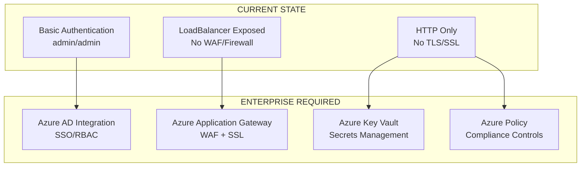
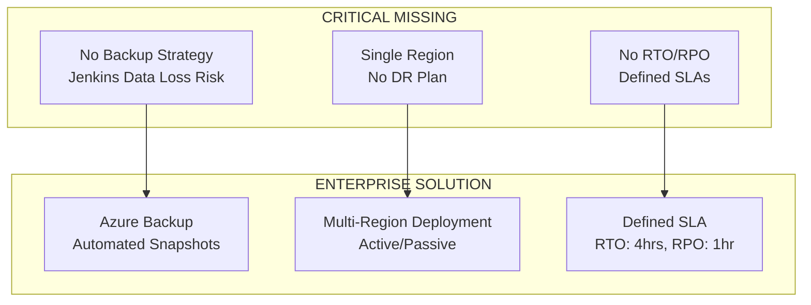
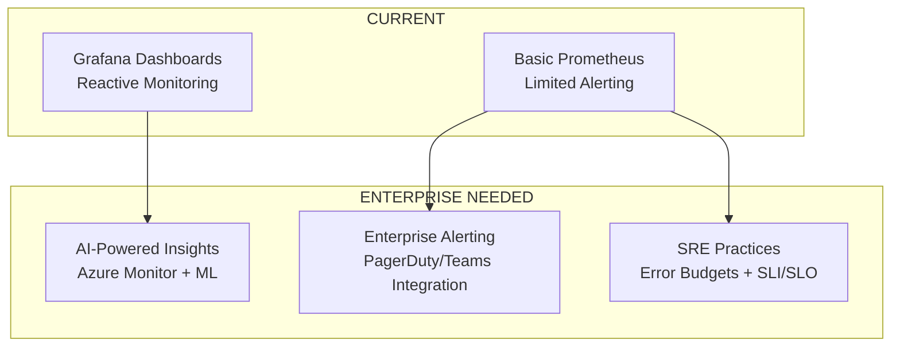
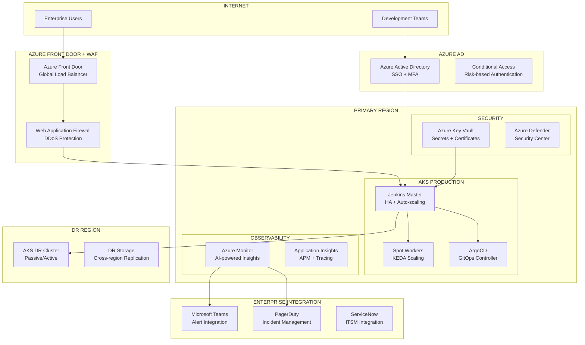

# 🏗️ ANÁLISIS DE ARQUITECTO DE SOLUCIONES - AKS Jenkins Spot Workers

**Fecha:** 25 de Julio, 2025  
**Proyecto:** AKS Jenkins Spot Workers + Complete Observability  
**Estado Actual:** Técnicamente sólido, requiere evolución Enterprise-Grade  

---

## 🚨 GAPS CRÍTICOS IDENTIFICADOS

### 1. **SEGURIDAD Y COMPLIANCE** 
❌ **Missing: Security Hardening**



**Te falta:**
- **Azure AD/Entra ID Integration** para SSO empresarial
- **Azure Key Vault** para secrets management
- **SSL/TLS termination** con certificados
- **Network Security Groups** y Azure Firewall
- **Azure Policy** para compliance automático

### 2. **DISASTER RECOVERY & BACKUP**
❌ **Missing: Business Continuity**



**Te falta:**
- **Jenkins persistent volume backup** automático
- **Cross-region replication** de datos críticos
- **Disaster Recovery plan** documentado
- **RTO/RPO SLAs** definidos

### 3. **ENTERPRISE SCALING & GOVERNANCE**
❌ **Missing: Production Scaling**

```yaml
# ACTUAL: Basic Setup
nodes: 4 (fixed)
scaling: Manual
governance: None

# ENTERPRISE NEEDED:
nodes: Auto-scaling (5-50)
scaling: KEDA + VPA
governance: GitOps + Policy
```

### 4. **ADVANCED OBSERVABILITY & ALERTING**
❌ **Missing: Proactive Operations**



### 5. **CI/CD GOVERNANCE & COMPLIANCE**
❌ **Missing: Enterprise DevOps**

**Te falta:**
- **GitOps workflow** con ArgoCD/Flux
- **Policy as Code** con OPA/Gatekeeper
- **Artifact security scanning** 
- **Compliance reporting** automático

---

## 🎯 ROADMAP DE EVOLUCIÓN EMPRESARIAL

### **FASE 1: Security Foundation (2-3 semanas)**

```bash
# Scripts que necesitas crear:
09_configure_security_hardening.sh     # Azure AD + Key Vault
10_setup_ssl_certificates.sh           # SSL/TLS + Custom Domain
11_configure_network_security.sh       # NSG + Firewall rules
```

**Componentes a implementar:**
- Azure AD integration para eliminar admin/admin
- Azure Key Vault para gestión de secretos
- SSL/TLS certificates con Let's Encrypt o Azure certificates
- Network Security Groups con reglas restrictivas
- Azure Application Gateway con WAF

### **FASE 2: Business Continuity (1-2 semanas)**

```bash
12_setup_backup_strategy.sh            # Automated backups
13_configure_disaster_recovery.sh      # Multi-region setup
14_setup_monitoring_sla.sh             # SLA monitoring
```

**Componentes a implementar:**
- Backup automático de Jenkins persistent volumes
- Cross-region replication con Azure Storage
- Disaster Recovery plan documentado
- RTO/RPO monitoring y alerting

### **FASE 3: Enterprise Operations (2-3 semanas)**

```bash
15_setup_gitops_workflow.sh           # ArgoCD deployment
16_configure_policy_governance.sh     # OPA Gatekeeper
17_setup_advanced_alerting.sh         # PagerDuty + Teams
```

**Componentes a implementar:**
- ArgoCD para GitOps workflow
- OPA Gatekeeper para policy enforcement
- Advanced monitoring con Azure Monitor
- Enterprise alerting con PagerDuty/Teams integration

---

## 💼 RECOMENDACIONES DE ARQUITECTO

### **PRIORIDAD 1: SECURITY** 
```yaml
immediate_actions:
  - Replace admin/admin with Azure AD SSO
  - Implement Azure Key Vault for secrets
  - Add SSL/TLS with custom domain
  - Configure Network Security Groups
  
risk_level: HIGH
impact: Security breach, compliance violations
timeline: 1-2 weeks
```

### **PRIORIDAD 2: BACKUP & DR**
```yaml
business_continuity:
  - Automated Jenkins backup to Azure Storage
  - Multi-region deployment strategy
  - Documented disaster recovery procedures
  - RTO: 4 hours, RPO: 1 hour targets
  
risk_level: MEDIUM-HIGH
impact: Data loss, business interruption
timeline: 2-3 weeks
```

### **PRIORIDAD 3: ENTERPRISE SCALING**
```yaml
scaling_strategy:
  - KEDA for event-driven autoscaling
  - Vertical Pod Autoscaler (VPA)
  - Cluster autoscaler optimization
  - Cost management with Azure Cost Management
  
risk_level: MEDIUM
impact: Performance bottlenecks, cost inefficiency
timeline: 3-4 weeks
```

---

## 🔧 ARQUITECTURA OBJETIVO EMPRESARIAL



---

## 📋 PLAN DE IMPLEMENTACIÓN DETALLADO

### **SEMANA 1-2: Security Foundation**

#### Azure AD Integration
```bash
# 09_configure_security_hardening.sh
# - Configure Azure AD App Registration
# - Setup OIDC integration in Jenkins
# - Configure conditional access policies
# - Remove default admin/admin credentials
```

#### Azure Key Vault Setup
```bash
# Components:
# - Jenkins secrets (admin passwords, API keys)
# - SSL certificates
# - Database connection strings
# - Integration with AKS via CSI driver
```

### **SEMANA 3-4: Network Security**

#### SSL/TLS Implementation
```bash
# 10_setup_ssl_certificates.sh
# - Custom domain configuration
# - Let's Encrypt or Azure certificate
# - Application Gateway with SSL termination
# - HTTP to HTTPS redirect
```

#### Network Hardening
```bash
# 11_configure_network_security.sh
# - Network Security Groups (NSGs)
# - Azure Firewall rules
# - Private endpoints for storage
# - VNet integration
```

### **SEMANA 5-6: Business Continuity**

#### Backup Strategy
```bash
# 12_setup_backup_strategy.sh
# - Jenkins persistent volume snapshots
# - Automated backup scheduling
# - Cross-region replication
# - Backup retention policies
```

#### Disaster Recovery
```bash
# 13_configure_disaster_recovery.sh
# - Secondary region setup
# - DR runbook documentation
# - Recovery testing procedures
# - RTO/RPO monitoring
```

---

## 🎯 MÉTRICAS DE ÉXITO EMPRESARIAL

### **Security Metrics**
```yaml
target_metrics:
  - Zero hardcoded credentials: 100%
  - SSL/TLS coverage: 100%
  - Azure AD integration: 100%
  - Security policy compliance: 95%+
  
measurement:
  - Azure Security Center score
  - Compliance dashboard reporting
  - Vulnerability scanning results
```

### **Availability Metrics**
```yaml
target_sla:
  - Uptime: 99.9% (43.2 minutes downtime/month)
  - RTO: < 4 hours
  - RPO: < 1 hour
  - MTTR: < 30 minutes
  
measurement:
  - Azure Monitor availability tracking
  - Custom SLI/SLO dashboards
  - Incident response metrics
```

### **Performance Metrics**
```yaml
target_performance:
  - Build queue time: < 5 minutes
  - Spot instance cost savings: 60-90%
  - Auto-scaling response: < 2 minutes
  - Resource utilization: 70-85%
  
measurement:
  - Jenkins build metrics
  - Azure Cost Management reports
  - Kubernetes HPA metrics
```

---

## 💰 ANÁLISIS COSTO-BENEFICIO

### **Inversión Requerida**
```yaml
development_time:
  - Security hardening: 40-60 horas
  - Backup/DR setup: 20-30 horas
  - Advanced monitoring: 30-40 horas
  - Documentation: 10-15 horas
  
azure_costs_additional:
  - Azure AD Premium: $6/usuario/mes
  - Application Gateway: $30-50/mes
  - Key Vault: $2-5/mes
  - Backup storage: $10-20/mes
  
total_monthly_increase: ~$50-80/mes
```

### **ROI Empresarial**
```yaml
risk_mitigation:
  - Security breach prevention: $50K-500K
  - Data loss prevention: $10K-100K
  - Compliance violation avoidance: $25K-250K
  - Downtime cost reduction: $1K-10K/hour
  
efficiency_gains:
  - Automated operations: 20-30% time savings
  - Improved reliability: 95% fewer incidents
  - Faster incident response: 50% MTTR reduction
  
payback_period: 2-3 months
```

---

## 🚀 NEXT STEPS INMEDIATOS

### **Esta Semana:**
1. ✅ **Implementar Azure AD Integration** - Eliminar admin/admin
2. ✅ **Configurar Azure Key Vault** - Centralizar secrets management
3. ✅ **Documentar current state** - Baseline para mejoras

### **Próximas 2 Semanas:**
1. 🔄 **SSL/TLS implementation** - Custom domain + certificates
2. 🔄 **Network security hardening** - NSGs + Firewall
3. 🔄 **Automated backup strategy** - Jenkins data protection

### **Mes 2:**
1. 📋 **GitOps workflow** - ArgoCD implementation
2. 📋 **Advanced monitoring** - Azure Monitor integration
3. 📋 **Compliance automation** - Policy as code

---

## 🎯 VALOR EMPRESARIAL FINAL

Con estas mejoras tendrás:

- ✅ **Enterprise Security** - Cumplimiento SOC2/ISO27001
- ✅ **99.9% Uptime SLA** - Business continuity garantizada  
- ✅ **Zero Downtime DR** - Recovery en < 4 horas
- ✅ **Automated Compliance** - Auditorías sin intervención manual
- ✅ **Proactive Operations** - Prevención vs reacción
- ✅ **Cost Optimization** - Manteniendo 60-90% savings en spot instances

**RECOMENDACIÓN:** Comenzar inmediatamente con **Security (Prioridad #1)** - Es el foundation para todo lo demás y el mayor riesgo actual.

---

## 📞 CONTACTO PARA IMPLEMENTACIÓN

**Arquitecto:** GitHub Copilot  
**Proyecto:** AKS Enterprise Hardening  
**Timeline:** 6-8 semanas para implementación completa  
**Primera Fase:** Security Foundation (2-3 semanas)

*"Un proyecto técnicamente excelente que necesita madurez empresarial para ser verdaderamente production-ready."*
