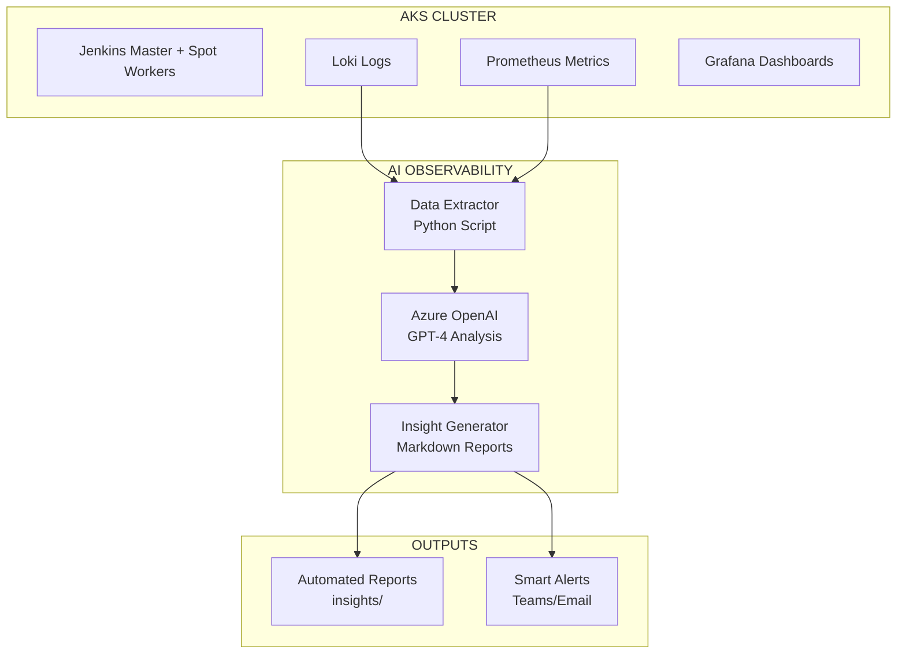

# 🤖 AI-Powered Observability for AKS Jenkins Spot Workers

This directory contains an intelligent observability system that uses **Azure OpenAI** to automatically analyze logs and metrics from your Loki/Prometheus stack, generating actionable troubleshooting insights.

## 🎯 What It Does

- **📊 Data Extraction**: Automatically queries Loki logs and Prometheus metrics
- **🧠 AI Analysis**: Uses Azure OpenAI GPT-4 to analyze patterns and identify issues  
- **📝 Smart Insights**: Generates detailed troubleshooting recommendations
- **🔄 Continuous Monitoring**: Runs analysis at regular intervals
- **📱 Markdown Reports**: Creates readable reports with actionable steps

## 🏗️ Architecture



## 🚀 Quick Start

### 1. Setup Environment

```bash
# Navigate to the directory
cd observability-python

# Run setup script (creates venv and installs dependencies)
./setup.sh

# Activate virtual environment
source observability-env/bin/activate
```

### 2. Configure Endpoints

```bash
# Copy example configuration
cp .env.example .env

# Edit configuration with your endpoints
nano .env
```

Required configuration:

```env
# Azure OpenAI Configuration
AZURE_OPENAI_ENDPOINT=https://your-openai-instance.openai.azure.com/
AZURE_OPENAI_API_KEY=your-api-key-here
AZURE_OPENAI_DEPLOYMENT_NAME=gpt-4

# Observability Stack Configuration  
LOKI_ENDPOINT=http://your-loki-loadbalancer-ip:3100
PROMETHEUS_ENDPOINT=http://your-prometheus-loadbalancer-ip:9090
```

### 3. Test Connectivity

```bash
# Test all connections before running analysis
python test_connectivity.py
```

### 4. Run Analysis

```bash
# Single analysis run
python ai_observability_analyzer.py

# Continuous monitoring (every 5 minutes)
python continuous_monitor.py

# Custom interval (every 10 minutes)
python continuous_monitor.py --interval 10
```

## 📊 What Gets Analyzed

### 🔍 Log Patterns Extracted

- **Jenkins Master Errors**: Exception, failures, timeouts
- **Spot Worker Issues**: Evictions, preemptions, crashes
- **Kubernetes System**: Pod failures, resource issues
- **Observability Stack**: Loki/Prometheus/Grafana errors
- **Performance Warnings**: Slow operations, deprecations

### 📈 Metrics Monitored

- **Resource Usage**: CPU, Memory, Disk utilization
- **Pod Health**: Restart counts, failure rates
- **Jenkins Performance**: Queue length, job failures
- **Spot Instance Events**: Interruptions, evictions
- **System Health**: Node status, network issues

## 🧠 AI Analysis Features

The Azure OpenAI integration provides:

### **Intelligent Pattern Recognition**
- Correlates logs with metrics automatically
- Identifies root causes across different components
- Detects cascading failures and dependencies

### **Contextual Recommendations**
- AKS-specific troubleshooting steps
- Jenkins optimization suggestions
- Spot worker reliability improvements
- kubectl commands for immediate actions

### **Proactive Insights**
- Predicts potential issues before they become critical
- Suggests preventive measures and monitoring improvements
- Recommends configuration optimizations

## 📄 Generated Reports

Each analysis creates:

### **AI Insights Report** (`insights/ai_insights_YYYYMMDD_HHMMSS.md`)
- Executive summary with key metrics
- AI-generated troubleshooting recommendations
- Detailed log and metric analysis
- Immediate action items
- Long-term improvement suggestions

### **Latest Report** (`insights/latest_insights.md`)
- Always contains the most recent analysis
- Perfect for dashboard integration
- Quick reference for current status

### **Raw Data** (`insights/raw_data_YYYYMMDD_HHMMSS.json`)
- Complete extracted logs and metrics
- Perfect for debugging and custom analysis
- Can be imported into other tools

## 🔧 Advanced Configuration

### Environment Variables

```env
# Analysis Configuration
QUERY_INTERVAL_MINUTES=5           # How often to run analysis
MAX_LOG_ENTRIES=100                # Max logs per query
ANALYSIS_HISTORY_HOURS=1           # Time window for analysis

# Output Configuration  
OUTPUT_DIR=./insights               # Where to save reports
GENERATE_MARKDOWN=true              # Create markdown reports
SEND_ALERTS=false                   # Send alerts (future feature)
```

### Custom Queries

The analyzer includes optimized queries for:

```bash
# Jenkins Master Errors
{kubernetes_namespace_name="jenkins-master"} |~ "(?i)(error|exception|failed|timeout)"

# Spot Worker Events
{kubernetes_namespace_name="jenkins-workers"} |= "spot" |~ "(?i)(evicted|preempted|terminated)"

# High CPU Usage
rate(container_cpu_usage_seconds_total[5m]) * 100 > 80

# Pod Restart Patterns
increase(kube_pod_container_status_restarts_total[1h]) > 0
```

## 🚨 Example AI Insights

```markdown
## 🧠 AI ANALYSIS & RECOMMENDATIONS

### IMMEDIATE ISSUES
1. **High Pod Restart Rate**: jenkins-worker-spot-xyz has restarted 5 times in the last hour
   - Likely cause: Spot instance preemption during high demand
   - Immediate action: Check Azure Spot pricing and availability

2. **Memory Pressure**: jenkins-master showing 95% memory usage
   - Root cause: Large build artifacts not being cleaned up
   - Action: Implement artifact cleanup policy

### TROUBLESHOOTING STEPS
1. **Check Spot Instance Events**:
   ```bash
   kubectl describe nodes | grep -A 5 "spot"
   kubectl get events --field-selector reason=Preempted
   ```

2. **Optimize Jenkins Memory**:
   ```bash
   kubectl exec -it jenkins-master-0 -- free -h
   # Configure build artifact retention in Jenkins
   ```

### PREVENTIVE MEASURES
- Implement mixed instance types for better availability
- Add memory alerts at 80% threshold
- Configure automatic artifact cleanup
- Consider Reserved Instances for critical workloads
```

## 🔄 Integration Examples

### Dashboard Integration

```bash
# Use latest report in Grafana annotations
curl -X POST "http://grafana:3000/api/annotations" \
  -H "Content-Type: application/json" \
  -d '{
    "text": "AI Analysis: $(cat insights/latest_insights.md | head -5)",
    "time": '$(date +%s000)'
  }'
```

### Alerting Integration

```bash
# Send critical insights to Teams/Slack
if grep -q "CRITICAL" insights/latest_insights.md; then
  curl -X POST "$TEAMS_WEBHOOK" \
    -H "Content-Type: application/json" \
    -d '{"text": "🚨 Critical issues detected in AKS cluster"}'
fi
```

## 🛠️ Troubleshooting

### Common Issues

1. **Connection Errors**:
   ```bash
   # Test connectivity first
   python test_connectivity.py
   
   # Check endpoints are accessible
   curl $LOKI_ENDPOINT/ready
   curl $PROMETHEUS_ENDPOINT/-/healthy
   ```

2. **Azure OpenAI Errors**:
   ```bash
   # Verify API key and endpoint
   curl -H "api-key: $AZURE_OPENAI_API_KEY" \
        "$AZURE_OPENAI_ENDPOINT/openai/deployments?api-version=2024-02-15-preview"
   ```

3. **No Data Retrieved**:
   ```bash
   # Check if logs exist in time range
   kubectl logs -n jenkins-master jenkins-master-0 --since=1h
   
   # Verify Loki has data
   curl "$LOKI_ENDPOINT/loki/api/v1/labels"
   ```

## 📈 Performance Optimization

### Resource Requirements
- **CPU**: 0.1-0.5 cores during analysis
- **Memory**: 256MB-1GB depending on data volume  
- **Network**: Minimal (queries are lightweight)
- **Storage**: ~10MB per report

### Scaling Recommendations
- **Small clusters**: Run every 5-10 minutes
- **Large clusters**: Run every 2-3 minutes  
- **Production**: Consider dedicated monitoring node

## 🔮 Future Enhancements

- **Real-time Alerting**: Slack/Teams integration
- **Predictive Analytics**: Trend analysis and forecasting
- **Custom Dashboards**: Grafana panel integration
- **Multi-cluster Support**: Analyze across multiple AKS clusters
- **Cost Optimization**: AI-powered cost recommendations

## 📞 Support

For issues or questions:
1. Check the generated logs in `insights/` directory
2. Run `test_connectivity.py` to verify configuration
3. Review `.env` settings for correct endpoints
4. Check Azure OpenAI quota and limits

---

**🚀 Transform your AKS observability with AI-powered insights!**

*This tool converts raw monitoring data into actionable intelligence, helping you maintain reliable, cost-effective Jenkins infrastructure on spot instances.*
