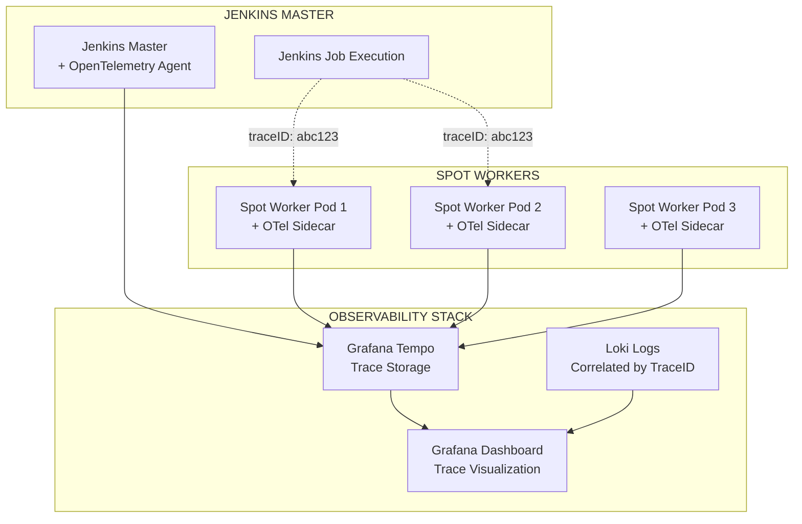

# 🕵️ Jenkins Master-Pod Distributed Tracing with Tempo

Esta carpeta contiene la implementación completa de **rastreo distribuido** para correlacionar fallos entre Jenkins Master y Pods usando **Grafana Tempo**.

## 🎯 **Objetivo Principal**

Cuando Jenkins Master falla, poder **trazar exactamente qué estaba pasando en los pods** en ese momento específico, especialmente útil para:

- 🔍 **Debugging de fallos Master-Pod**
- 📊 **Correlación temporal de eventos**  
- 🚨 **Análisis de problemas en spot workers**
- 🔗 **Trazabilidad end-to-end de jobs Jenkins**

## 📁 **Estructura del Proyecto**

```
tempo/
├── install_tempo_tracing.sh           # 🚀 Script de instalación automática
├── jenkins_trace_analyzer.py          # 🕵️ Analizador avanzado de trazas
├── helm/
│   └── tempo_helm_values.yaml         # ⚙️ Configuración Helm de Tempo
├── grafana-config/
│   ├── tempo-datasources.yaml         # 📊 Datasources con correlación
│   └── jenkins-tracing-dashboard.json # 📈 Dashboard específico Jenkins
└── jenkins-instrumentation/
    └── jenkins-otel-config.yaml       # 🎛️ Instrumentación OpenTelemetry
```

## 🚀 **Instalación Rápida**

### 1. Ejecutar Instalación Automática

```bash
cd tempo
./install_tempo_tracing.sh
```

### 2. Configurar Jenkins

Después de la instalación, configurar Jenkins:

```bash
# Reiniciar Jenkins para aplicar instrumentación
kubectl rollout restart statefulset/jenkins-master -n jenkins-master

# Verificar que los pods se reinicien con OpenTelemetry
kubectl get pods -n jenkins-master -w
```

### 3. Configurar Plugin Jenkins

1. **Instalar Plugin OpenTelemetry**:
   - Jenkins → Manage Jenkins → Manage Plugins
   - Buscar "OpenTelemetry" → Install

2. **Configurar Endpoint**:
   - Jenkins → Manage Jenkins → Configure System
   - OpenTelemetry section:
     - Endpoint: `http://tempo.observability-stack.svc.cluster.local:4317`
     - Protocol: `GRPC`

## 🔍 **Cómo Funciona la Correlación**

### **Flujo de Tracing**



### **Ejemplo de Correlación**

**Cuando Jenkins Master falla** a las `15:30:25`:

1. **🔍 Buscar traza**: `traceID=abc123` en Tempo
2. **📊 Ver timeline**: Spans de Master → Pod → Error
3. **📝 Correlacionar logs**: Filtrar logs por `traceID=abc123`
4. **🎯 Identificar causa**: Ver exactamente qué pasó en el pod

## 📊 **Dashboard Jenkins Tracing**

El dashboard incluye:

### **🕵️ Secciones Principales**

1. **Trace Timeline**: Vista temporal de toda la ejecución
2. **Job Execution Traces**: Trazas específicas de jobs Jenkins
3. **Pod Communication**: Comunicación Master-Pod
4. **Error Analysis**: Análisis de fallos correlacionados
5. **Service Dependencies**: Mapa de dependencias
6. **Correlated Logs**: Logs filtrados por traceID

### **🔗 Correlaciones Automáticas**

- **Traces → Logs**: Click en trace → Ver logs relacionados
- **Logs → Traces**: Click en traceID en logs → Ver trace completo
- **Metrics → Traces**: Alertas de Prometheus → Traces relacionadas

## 🧠 **Análisis Avanzado con IA**

### **Ejecutar Analizador de Trazas**

```bash
# Configurar entorno (si no tienes el de observability-python)
cd tempo
python3 -m venv trace-env
source trace-env/bin/activate
pip install aiohttp requests pandas python-dotenv

# Configurar endpoints
export TEMPO_ENDPOINT="http://localhost:3200"
export LOKI_ENDPOINT="http://localhost:3100"

# Ejecutar análisis
python jenkins_trace_analyzer.py
```

### **Tipo de Análisis que Proporciona**

- 🔍 **Pattern Recognition**: Patrones de fallo Master-Pod
- ⏱️ **Timeline Correlation**: Correlación temporal de eventos
- 🎯 **Root Cause Analysis**: Análisis de causa raíz
- 📊 **Failure Impact**: Impacto de fallos en spot workers
- 💡 **Recommendations**: Recomendaciones específicas

## 🛠️ **Casos de Uso Específicos**

### **1. Debug Job Fallido**

```bash
# Scenario: Job Jenkins falló a las 15:30
# 1. Buscar traces en Grafana
# 2. Filtrar por tiempo: 15:25 - 15:35
# 3. Encontrar traceID del job fallido
# 4. Ver correlación con logs de pods
```

### **2. Análisis Spot Worker Eviction**

```bash
# Scenario: Spot worker fue evicted durante job
# 1. Buscar traces con span.kubernetes.node_type=spot
# 2. Correlacionar con eventos de Kubernetes
# 3. Ver timeline: Job start → Eviction → Job failure
```

### **3. Performance Analysis**

```bash
# Scenario: Jobs lentos en ciertos pods
# 1. Filtrar traces por duración > 5min
# 2. Analizar spans de comunicación Master-Pod
# 3. Identificar bottlenecks en la cadena
```

## 📈 **Métricas y Alertas**

### **Alertas Sugeridas**

```yaml
# Prometheus Alert Rules
- alert: HighTraceErrorRate
  expr: rate(traces_total{status="error"}[5m]) > 0.1
  for: 2m
  annotations:
    summary: "High error rate in distributed traces"

- alert: JenkinsJobTraceFailure
  expr: increase(traces_total{service_name="jenkins-master",status="error"}[10m]) > 3
  for: 1m
  annotations:
    summary: "Multiple Jenkins job trace failures detected"
```

### **Métricas Clave**

- **Trace Success Rate**: % de trazas exitosas
- **Average Trace Duration**: Duración promedio Master→Pod
- **Error Correlation Rate**: % de errores correlacionados
- **Spot Worker Trace Impact**: Impacto de evictions en traces

## 🔧 **Troubleshooting**

### **Problemas Comunes**

1. **No aparecen trazas**:
   ```bash
   # Verificar instrumentación
   kubectl logs -n jenkins-master jenkins-master-0 | grep -i opentelemetry
   
   # Verificar conectividad a Tempo
   kubectl exec -n jenkins-master jenkins-master-0 -- curl tempo.observability-stack.svc.cluster.local:4317
   ```

2. **Trazas sin correlación con logs**:
   ```bash
   # Verificar que logs incluyen traceID
   kubectl logs -n jenkins-master jenkins-master-0 | grep traceID
   
   # Verificar configuración Loki datasource
   kubectl get configmap grafana-loki-datasource-updated -o yaml
   ```

3. **Dashboard no muestra datos**:
   ```bash
   # Verificar datasources en Grafana
   curl -u admin:password http://135.236.73.36/api/datasources
   
   # Verificar queries de Tempo
   curl http://localhost:3200/api/search?tags=service.name:jenkins-master
   ```

## 🎯 **Próximos Pasos**

1. **Ejecutar** `./install_tempo_tracing.sh`
2. **Configurar** Jenkins con OpenTelemetry plugin
3. **Ejecutar** algunos jobs para generar trazas
4. **Explorar** dashboard en Grafana
5. **Analizar** correlaciones con `jenkins_trace_analyzer.py`

## 🏆 **Beneficios Esperados**

### **Antes (Sin Tracing)**
- ❌ "Jenkins falló pero no sé por qué"
- ❌ "El pod crasheó pero no sé cuándo"
- ❌ "No puedo correlacionar eventos"

### **Después (Con Tracing)**
- ✅ **Visibilidad completa** de flujo Master→Pod
- ✅ **Correlación automática** de logs y métricas
- ✅ **Timeline preciso** de eventos
- ✅ **Root cause analysis** automatizado
- ✅ **Insights específicos** para spot workers

---

## 📞 **Soporte**

Para problemas o preguntas:

1. **Verificar logs**: `kubectl logs -n observability-stack tempo-0`
2. **Comprobar conectividad**: `./install_tempo_tracing.sh` (modo test)
3. **Revisar configuración**: Archivos en `grafana-config/`

---

**🚀 ¡Ahora puedes rastrear exactamente qué pasa en tus pods cuando Jenkins Master falla!**

*Implementación completa de observabilidad distribuida para AKS Jenkins con Spot Workers*
